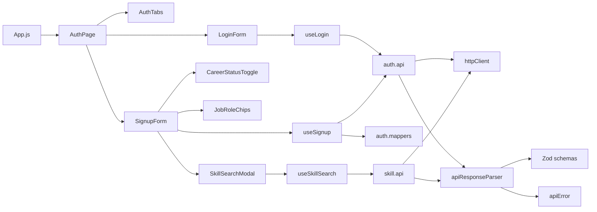

# Auth 구조 및 로깅 가이드

## 문서 목적

현재 프론트엔드 인증 기능의 파일 구조, 처리 흐름, 오류 처리 및 로깅 기준을 정리한다.

> 기준 경로: `frontend/src`

## 전체 파일 구조

```text
src/
├─ App.js                              # AuthPage 렌더링
├─ pages/
│  └─ AuthPage.jsx                     # 인증 화면과 로그인/회원가입 탭
├─ components/auth/
│  ├─ AuthTabs.jsx                     # 탭 전환
│  ├─ LoginForm.jsx                    # 로그인 입력 및 제출
│  ├─ SignupForm.jsx                   # 회원가입 상태 및 제출
│  ├─ CareerStatusToggle.jsx           # 신입/경력 선택
│  ├─ JobRoleChips.jsx                 # 희망 직무 선택
│  └─ SkillSearchModal.jsx             # 기술 검색 및 선택
├─ hooks/
│  ├─ auth/
│  │  ├─ useLogin.js                   # 로그인 요청 상태와 오류
│  │  └─ useSignup.js                  # 가입 요청 상태와 오류
│  └─ skill/
│     └─ useSkillSearch.js             # 검색, 요청 취소, 결과 상태
├─ api/
│  ├─ auth/
│  │  ├─ auth.api.js                   # signup/login/refresh/logout API
│  │  ├─ auth.constants.js             # endpoint, 직무 및 경력 상수
│  │  ├─ auth.mappers.js               # 폼 상태 → 가입 요청 변환
│  │  └─ auth.schemas.js               # 인증 응답 Zod 검증
│  ├─ skill/
│  │  ├─ skill.api.js                  # 기술 검색 API
│  │  └─ skill.schemas.js              # 기술 응답 검증
│  └─ common/
│     ├─ httpClient.js                 # fetch, 헤더, body 파싱
│     ├─ apiResponseParser.js           # 응답 검증과 성공/실패 분기
│     └─ apiError.js                    # 공통 API 오류 타입
└─ styles/
   └─ auth.css                         # 인증 화면 스타일
```

## 계층별 책임

| 계층 | 책임 | 관련 파일 |
|---|---|---|
| Page | 인증 화면 구성과 탭 선택 | `AuthPage.jsx` |
| Component | 입력값과 사용자 상호작용 | `components/auth/*` |
| Hook | 비동기 요청, 로딩 및 오류 상태 | `useLogin.js`, `useSignup.js`, `useSkillSearch.js` |
| Mapper | UI 상태를 API 계약으로 변환 | `auth.mappers.js` |
| API | endpoint 호출과 parser 선택 | `auth.api.js`, `skill.api.js` |
| Schema | 서버 응답 런타임 검증 | `auth.schemas.js`, `skill.schemas.js` |
| Common | HTTP 처리와 오류 표준화 | `api/common/*` |

컴포넌트는 Hook만 호출한다. Hook은 UI 상태를, API 계층은 통신과 응답 계약 검증을 담당한다.

## 의존 관계도



## 주요 처리 흐름

### 로그인

1. `LoginForm`이 이메일과 비밀번호를 관리한다.
2. 제출 시 `useLogin.login`을 호출하고 Hook이 로딩 및 오류 상태를 관리한다.
3. `authApi.login`이 이메일 공백을 제거하고 `POST /api/v1/auth/login`을 호출한다.
4. `loginResponseSchema`가 응답을 검증한다.
5. 성공 데이터는 `onLoginSuccess`로 전달되고 실패 메시지는 `role="alert"`에 표시된다.

### 회원가입

1. `SignupForm`이 계정, 직무, 경력 및 관심 기술 상태를 관리한다.
2. 신입 전환 시 숨겨진 경력 연차를 초기화한다.
3. `createSignupRequest`가 이메일 공백, 신입 연차, 기술명 중복을 정리한다.
4. `authApi.signup`이 `POST /api/v1/auth/signup`을 호출한다.
5. 성공 데이터는 `onSignupSuccess`로 전달된다.

### 기술 검색

1. 모달이 열릴 때 현재 기술을 작업본(`draftSkills`)으로 복사한다.
2. 검색 입력을 300ms debounce하고 새 검색 전 이전 요청을 취소한다.
3. 검색어가 있으면 서버 결과, 없으면 추천 기술을 표시한다.
4. “선택 완료”에서만 작업본을 회원가입 폼에 반영한다.

### 토큰 갱신과 로그아웃

| 기능 | Method | Endpoint | 인증 정보 |
|---|---|---|---|
| 토큰 갱신 | POST | `/api/v1/auth/refresh` | body의 `refreshToken` |
| 로그아웃 | POST | `/api/v1/auth/logout` | Bearer `accessToken`, body의 `refreshToken` |

두 API는 `auth.api.js`에 있지만 UI/Hook에는 아직 연결되지 않았다. 세션 저장, 자동 갱신, 로그아웃 후 상태 정리는 별도의 인증 상태 관리 계층이 필요하다.

## 오류 처리 현황

| 오류 유형 | 위치 | 처리 |
|---|---|---|
| 폼 변환 오류 | `SignupFormValidationError` | Hook에서 메시지를 폼에 표시 |
| API 업무 오류 | `ApiRequestError` | 서버 code/message와 HTTP status 보존 |
| 응답 계약 오류 | `ApiResponseValidationError` | 원본 응답과 명세 불일치 구분 |
| 네트워크/기타 오류 | `fetch`/런타임 | `Error.message`을 폼에 표시 |
| 검색 취소 | `AbortError` | 사용자 오류 없이 종료 |

현재 `console.log`, 외부 로깅 SDK, 분석 이벤트 전송은 없다. 사용자 오류 표시는 있지만 운영용 구조화 로그는 아직 없다.

## 권장 로그 사항

| 이벤트명 | 시점 | 안전한 필드 예시 |
|---|---|---|
| `auth.login.requested` | 로그인 시작 | `requestId`, `timestamp` |
| `auth.login.succeeded` | 로그인 성공 | `requestId`, `userId`, `durationMs` |
| `auth.login.failed` | 로그인 실패 | `requestId`, `errorCode`, `httpStatus` |
| `auth.signup.requested` | 가입 시작 | `requestId`, `desiredJobRole`, `careerStatus` |
| `auth.signup.succeeded` | 가입 성공 | `requestId`, `userId`, `durationMs` |
| `auth.signup.failed` | 가입 실패 | `requestId`, `errorCode`, `httpStatus` |
| `auth.refresh.failed` | 갱신 실패 | `requestId`, `errorCode`, `httpStatus` |
| `auth.logout.succeeded` | 로그아웃 성공 | `requestId`, `durationMs` |
| `skill.search.failed` | 기술 검색 실패 | `requestId`, `errorCode`, `httpStatus` |
| `api.response.invalid` | Zod 검증 실패 | `requestId`, `endpoint`, `schemaName` |

### 절대 기록하지 않는 값

- 비밀번호
- access token 및 refresh token
- Authorization 헤더
- 전체 API 요청/응답 body
- 원문 이메일 등 불필요한 개인정보

브라우저 콘솔은 운영 로그 수단으로 적절하지 않다. 운영 로그는 승인된 모니터링 도구 또는 서버로 전송하고 민감정보를 제거한다.

## 현재 구현 시 주의사항

- 로그인 토큰 저장 위치가 정의되지 않았다.
- refresh/logout API가 UI/Hook과 연결되지 않았다.
- 비밀번호 찾기 버튼은 동작이 없는 UI이다.
- 기술 검색의 `isLoading`이 모달 로딩 UI에 사용되지 않는다.
- API 명세 변경 시 Zod schema도 함께 수정해야 한다.
- `responseBody` 로깅 전 개인정보와 토큰을 제거해야 한다.

## 변경 시 확인 목록

- [ ] endpoint와 백엔드 명세가 일치하는가?
- [ ] 요청 변환이 mapper에 모여 있는가?
- [ ] 응답 schema가 실제 응답과 일치하는가?
- [ ] 로딩 중 중복 제출이 방지되는가?
- [ ] 오류가 `role="alert"`로 제공되는가?
- [ ] 로그에서 비밀번호, 토큰, 개인정보가 제외되는가?
- [ ] 검색 취소가 장애로 집계되지 않는가?
- [ ] 로그인/회원가입/검색의 성공 및 실패 경로를 테스트했는가?
