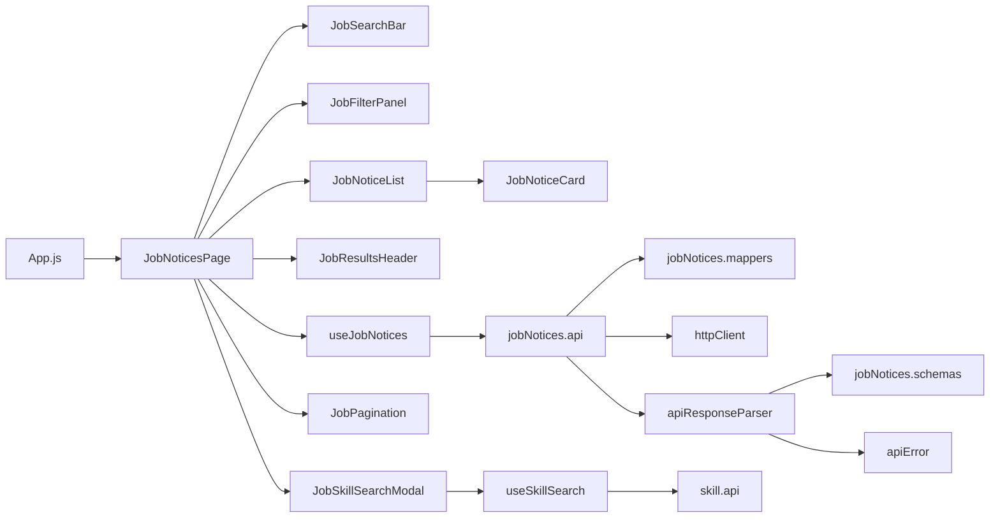

# 채용공고 구조 가이드

## 문서 목적

현재 프론트엔드에 구현된 채용공고 목록 기능의 파일 구조, 계층별 책임, 데이터 흐름과 API 계약을 정리한다.

> 기준 경로: `frontend/src`

## 전체 파일 구조

```text
src/
├─ App.js                                      # 채용공고 목록 라우트 등록
├─ pages/
│  └─ JobNoticesPage.jsx                       # 목록 화면 구성과 필터 상태 조정
├─ components/jobNotices/
│  ├─ JobSearchBar.jsx                         # 회사명·공고명 키워드 검색
│  ├─ JobFilterPanel.jsx                       # 직무·기술·경력·지역 필터
│  ├─ JobSkillSearchModal.jsx                  # 기술 검색과 다중 선택 모달
│  ├─ JobResultsHeader.jsx                     # 결과 건수와 정렬 조건
│  ├─ JobNoticeList.jsx                        # 로딩·오류·빈 결과·목록 분기
│  ├─ JobNoticeCard.jsx                        # 공고 요약 카드와 마감일 표시
│  └─ JobPagination.jsx                        # 페이지 이동
├─ hooks/jobNotices/
│  └─ useJobNotices.js                         # 목록 조회와 로딩·오류·재시도 상태
├─ api/jobNotices/
│  ├─ jobNotices.api.js                        # 채용공고 목록 API 호출
│  ├─ jobNotices.constants.js                  # endpoint, 필터·정렬·페이지 상수
│  ├─ jobNotices.mappers.js                    # 필터를 쿼리 문자열로 변환
│  └─ jobNotices.schemas.js                    # 목록 응답 Zod 검증
├─ api/common/
│  ├─ httpClient.js                            # Base URL, fetch, 응답 body 파싱
│  ├─ apiResponseParser.js                     # 응답 검증과 성공·실패 분기
│  └─ apiError.js                              # 공통 API 오류 타입
├─ hooks/skill/
│  └─ useSkillSearch.js                        # 기술 검색 요청과 결과 상태
├─ api/skill/
│  ├─ skill.api.js                             # 기술 검색 API 호출
│  └─ skill.schemas.js                         # 기술 검색 응답 검증
├─ styles/
│  └─ job-notices.css                          # 채용공고 화면과 반응형 스타일
└─ App.test.js                                 # 루트 라우트와 목록 API 호출 확인
```

## 계층별 책임

| 계층 | 책임 | 관련 파일 |
|---|---|---|
| Route | `/`, `/jobs` 경로를 목록 화면에 연결 | `App.js` |
| Page | draft/applied 필터, 페이지, 모달 상태를 조정하고 컴포넌트를 조합 | `JobNoticesPage.jsx` |
| Component | 검색·필터 입력, 결과 표시, 카드와 페이지 이동 등 사용자 상호작용 | `components/jobNotices/*` |
| Hook | 비동기 목록 조회, 이전 요청 취소, 로딩·오류·재시도 상태 관리 | `useJobNotices.js` |
| Mapper | 입력값 정규화와 API 쿼리 파라미터 생성 | `jobNotices.mappers.js` |
| API | endpoint 호출과 parser 선택 | `jobNotices.api.js` |
| Schema | 공고, 페이지, 성공·실패 응답 구조 검증 | `jobNotices.schemas.js` |
| Common | HTTP 처리와 공통 오류 표준화 | `api/common/*` |
| Style | 데스크톱·모바일 레이아웃과 상태별 UI 스타일 | `job-notices.css` |

Page는 화면 전용 상태를 관리하고, Hook은 서버 조회 상태를 담당한다. API 요청 값의 정규화와 서버 응답 계약 검증은 각각 Mapper와 Schema 계층에서 처리한다.

## 의존 관계도



## 주요 처리 흐름

### 최초 목록 조회

1. `App.js`가 `/` 또는 `/jobs`에서 `JobNoticesPage`를 렌더링한다.
2. Page가 기본 필터, 0번 페이지와 페이지 크기 12를 `useJobNotices`에 전달한다.
3. Hook이 기존 요청을 취소하고 새 `AbortController`를 생성한다.
4. `createJobNoticesSearchParams`가 필터와 페이지 값을 쿼리 파라미터로 변환한다.
5. `jobNoticesApi.getJobNotices`가 `GET /api/v1/job-notices`를 호출한다.
6. Zod schema와 공통 parser가 응답 계약과 성공 여부를 검증한다.
7. Hook이 공고 목록, 현재 페이지, 페이지 크기와 전체 건수를 화면에 반환한다.

### 검색과 필터 적용

Page는 입력 중인 `draftFilters`와 서버 조회에 사용하는 `appliedFilters`를 분리한다.

1. 검색어나 필터를 변경하면 `draftFilters`만 갱신된다.
2. 검색 제출 또는 `공고 보기`를 누르면 draft 값이 applied 값으로 복사된다.
3. 새 조건을 적용할 때 페이지는 0으로 초기화된다.
4. 정렬 조건은 선택 즉시 draft와 applied 양쪽에 반영되어 다시 조회한다.
5. `전체 초기화`는 두 필터 상태와 페이지를 기본값으로 되돌린다.

이 구조는 여러 필터를 고르는 도중 불필요한 API 요청이 발생하는 것을 막는다.

### 기술 스택 검색

1. 기술 검색 모달을 열면 현재 선택값을 `draftSkillNames`에 복사한다.
2. 검색어가 없으면 Java, React 등 인기 기술 목록을 표시한다.
3. 검색어 입력을 300ms debounce한 뒤 공통 `useSkillSearch` Hook을 호출한다.
4. 모달 안에서 기술을 여러 개 선택하거나 해제한다.
5. `선택 완료` 시에만 선택값을 Page의 draft 필터에 반영한다.
6. 이후 `공고 보기` 또는 검색 제출 시 서버 조회 조건에 포함된다.

### 페이지 이동과 재시도

- 페이지 번호는 화면에 1부터 표시하지만 API에는 0부터 시작하는 값을 보낸다.
- 한 번에 최대 5개의 페이지 버튼을 표시한다.
- 페이지 변경 후 결과 영역으로 부드럽게 스크롤한다.
- 조회 실패 화면의 `다시 시도`는 `reloadCount`를 증가시켜 같은 조건을 다시 요청한다.
- 필터, 페이지 또는 재시도 값이 바뀌면 진행 중인 이전 요청을 취소한다.

## 목록 API 계약

### 요청

| 항목 | 값 |
|---|---|
| Method | `GET` |
| Endpoint | `/api/v1/job-notices` |
| 인증 정보 | 현재 구현에서는 전달하지 않음 |

| Query | 설명 | 전송 조건 |
|---|---|---|
| `keyword` | 회사명 또는 공고명 검색어 | 공백 제거 후 값이 있을 때 |
| `jobRole` | 직무 코드 | 값이 있을 때 |
| `skillNames` | 쉼표로 연결한 기술명 | 하나 이상 선택했을 때 |
| `experienceLevel` | `NEW`, `EXPERIENCED` | `ANY`가 아닐 때 |
| `location` | 지역명 | 값이 있을 때 |
| `sort` | `latest`, `deadline` | 값이 있을 때 |
| `page` | 0부터 시작하는 페이지 | 항상 |
| `size` | 페이지당 공고 수 | 항상 |

Mapper는 문자열 앞뒤 공백을 제거하고, 기술명은 대소문자를 무시해 중복을 제거한다.

### 성공 응답 데이터

```text
data
├─ content[]
│  ├─ jobNoticeId
│  ├─ companyName
│  ├─ title
│  ├─ jobCategory
│  ├─ locationText
│  ├─ experienceLevel
│  ├─ employmentType
│  ├─ deadlineAt
│  ├─ skillNames[]
│  └─ isBookmarked
├─ page
├─ size
└─ totalElements
```

`jobCategory`와 `experienceLevel`은 constants에 정의된 enum만 허용한다. `deadlineAt`은 파싱 가능한 날짜 문자열 또는 `null`이어야 하며, 위치·고용 형태도 `null`을 허용한다.

## 화면 상태 처리

| 상태 | 위치 | 표시 방식 |
|---|---|---|
| 조회 중 | `JobNoticeList` | 스켈레톤 카드 6개와 `aria-busy` 표시 |
| 조회 실패 | `JobNoticeList` | `role="alert"`, 오류 메시지와 재시도 버튼 |
| 빈 결과 | `JobNoticeList` | 검색어나 필터 변경 안내 |
| 조회 성공 | `JobNoticeList` | `JobNoticeCard` 목록 |
| 기술 검색 중 | `JobSkillSearchModal` | 검색 진행 문구 |
| 기술 검색 실패 | `JobSkillSearchModal` | `role="alert"` 오류 문구 |
| 북마크 처리 중 | `JobNoticeCard` | 해당 카드의 북마크 버튼 비활성화 |

공고 카드에는 직무, 경력, 고용 형태, 위치, 최대 3개의 기술과 마감 상태를 표시한다. 마감일이 없으면 `상시채용`, 지났으면 `마감`, 오늘이면 `오늘 마감`, 그 외에는 `D-n`으로 표시한다.

## 오류 처리 현황

| 오류 유형 | 위치 | 처리 |
|---|---|---|
| API 업무 오류 | `ApiRequestError` | 서버 code/message와 HTTP status 보존 |
| 응답 계약 오류 | `ApiResponseValidationError` | 원본 응답과 schema 불일치 구분 |
| 네트워크·기타 오류 | `useJobNotices` | `Error.message`를 오류 화면에 표시 |
| 요청 취소 | `AbortError` | 사용자 오류 없이 종료 |

현재 채용공고 전용 운영 로그나 분석 이벤트 전송은 없다. 오류 메시지를 사용자에게 표시하지만 별도의 모니터링 계층에는 전달하지 않는다.

## 현재 구현 및 주의사항

- `App.js`에는 목록 경로인 `/`와 `/jobs`만 등록되어 있다.
- 카드 링크는 `/jobs/:jobNoticeId`를 가리키지만 상세 페이지 라우트와 상세 조회 API는 아직 연결되어 있지 않다. 현재는 wildcard 라우트에 의해 `/`로 이동한다.
- 헤더의 `/calendar`, `/resume` 링크도 아직 전용 라우트가 없어 `/`로 이동한다.
- 북마크 버튼과 pending 상태 인터페이스는 마련되어 있으나, 기본 `onBookmarkToggle`은 빈 함수이며 북마크 API는 연결되어 있지 않다.
- 목록 API 요청에는 인증 토큰을 전달하지 않는다. 사용자별 `isBookmarked` 값이 인증을 요구한다면 세션 연동 정책이 필요하다.
- 지역 목록과 인기 기술 목록은 각각 컴포넌트 내부 상수로 관리된다. 서버 또는 공통 상수와 동기화가 필요할 수 있다.
- `jobNotices.schemas.js`는 공통 실패 schema를 `api/auth/auth.schemas.js`에서 가져온다. 기능 간 결합을 줄이려면 공통 응답 schema로 이동하는 방안을 고려한다.
- 목록 전용 단위 테스트는 아직 없고, `App.test.js`에서 루트 렌더링과 API 호출만 확인한다.

## 변경 시 확인 목록

- [ ] `/`, `/jobs` 라우트에서 채용공고 목록이 정상 렌더링되는가?
- [ ] endpoint와 쿼리 파라미터 이름이 백엔드 명세와 일치하는가?
- [ ] 필터 기본값과 enum이 실제 API 계약과 일치하는가?
- [ ] 검색·필터 적용 시 페이지가 0으로 초기화되는가?
- [ ] 입력 중인 draft 필터가 적용 전 API 요청을 발생시키지 않는가?
- [ ] 연속 조회 시 이전 요청 취소가 사용자 오류로 노출되지 않는가?
- [ ] 응답 필드를 변경할 때 Zod schema와 카드 표시도 함께 수정했는가?
- [ ] 로딩, 오류, 빈 결과와 재시도 경로를 테스트했는가?
- [ ] 페이지의 첫 페이지·중간 페이지·마지막 페이지 이동을 테스트했는가?
- [ ] 상세 페이지나 북마크를 연결할 때 인증 정보와 오류 상태를 처리했는가?
- [ ] 모바일 너비에서 필터, 카드와 페이지네이션을 확인했는가?

## 변경 로그

### 2026-07-13 — 채용공고 목록 구조 문서 추가

- 채용공고 목록의 Page, Component, Hook, API, Mapper와 Schema 역할을 정리했다.
- 검색·필터·기술 선택·페이지 이동과 재시도 흐름을 기록했다.
- 목록 API의 요청 쿼리와 응답 데이터 계약을 문서화했다.
- 상세 페이지, 북마크와 인증 연동 등 아직 연결되지 않은 기능을 구분해 기록했다.
